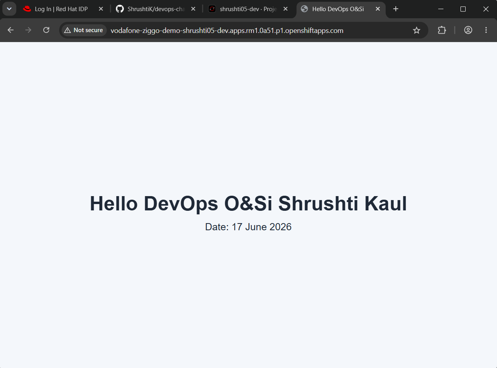

# O&Si DevOps Challenge

## Overview

This project builds a Dockerized web server that serves a simple webpage and deploys it on OpenShift.



The application is containerized with Docker, published to Docker Hub, and deployed to Red Hat OpenShift Developer Sandbox using GitHub Actions and Helm.


## Web Server and Webpage

The static web page can be found in `index.html`. It displays the required greeting and date. Nginx is used as the web server here because the application is a static webpage and does not require a backend runtime.

## Docker Containerization

`Dockerfile` helps with creating a Docker image for the web server. The image uses:

```text
nginxinc/nginx-unprivileged:stable-alpine
```

This base image is maintained and suitable for OpenShift's restricted security model, where containers should not rely on running as root.


## Container Registry

The image used is published to Docker Hub: [docker.io/shrushti5/devops-challenge](https://hub.docker.com/repository/docker/shrushti5/devops-challenge/general)

### Docker Image Creation

The Docker image is built from the `Dockerfile`.

The image uses:

```text
nginxinc/nginx-unprivileged:stable-alpine
```

This base image was chosen because it is lightweight, maintained, and suitable for OpenShift, where containers should not depend on running as root.

The Dockerfile copies the static webpage into the Nginx web root:

```dockerfile
FROM nginxinc/nginx-unprivileged:stable-alpine

COPY index.html /usr/share/nginx/html/index.html

EXPOSE 8080
```

The container listens on port `8080`, which matches the unprivileged Nginx image.


### Building the Docker Image Locally

From the repository root, build the image with the Dockerfile available in the same directory level:

```bash
docker build -t devops-challenge:local .
```

Run the image locally:

```bash
docker run --rm -p 8080:8080 devops-challenge:local
```

Open the webpage:

```text
http://localhost:8080
```

You can also verify with:

```bash
curl http://localhost:8080
```

### Publish the Image to Docker Hub

The image is published to Docker Hub as:

```text
shrushti5/devops-challenge
```

For a manual push, log in to Docker Hub first with your username and personal access token:

```bash
docker login
```

Build the image with the Docker Hub repository name:

```bash
docker build -t shrushti5/devops-challenge:latest .
```

Push the image:

```bash
docker push shrushti5/devops-challenge:latest
```

Pull the published image:

```bash
docker pull shrushti5/devops-challenge:latest
```

Run the published image locally:

```bash
docker run --rm -p 8080:8080 shrushti5/devops-challenge:latest
```

## CI/CD Pipeline

The CI/CD pipeline is implemented using GitHub Actions.

The workflow is triggered on every push to the `main` branch.

The pipeline automates the following process:

1. Check out the repository.
2. Build a test Docker image.
3. Run the container and smoke-test the webpage.
4. Scan the image with Trivy for high and critical vulnerabilities.
5. Log in to Docker Hub.
6. Build and push the Docker image to Docker Hub.
7. Log in to OpenShift Developer Sandbox.
8. Lint the Helm chart.
9. Deploy the application to OpenShift using Helm.
10. Verify that the OpenShift Route is accessible.

The pipeline pushes the image using two tags:

```text
latest
<git-commit-sha>
```

The OpenShift deployment uses the commit SHA tag so the deployed version can be traced back to a specific commit.

### CI/CD Configuration

The GitHub Actions workflow uses repository variables for non-sensitive values:

```text
DOCKERHUB_USERNAME
OPENSHIFT_NAMESPACE
```

The workflow uses repository secrets for sensitive values:

```text
DOCKERHUB_PAT
OPENSHIFT_SERVER
OPENSHIFT_TOKEN
```

`DOCKERHUB_PAT` is a Docker Hub Personal Access Token used by GitHub Actions to push the image.

`OPENSHIFT_SERVER` and `OPENSHIFT_TOKEN` come from the OpenShift Developer Sandbox login command.

To get the OpenShift token from the web console:

```text
User menu
→ Copy login command
→ Display token
```

The command looks like:

```bash
oc login --token=<openshift-token> --server=<openshift-server-url>
```

## OpenShift Deployment

The application is deployed to Red Hat OpenShift Developer Sandbox.

Deployment is managed with a Helm chart located at:

```text
helm/webserver
```

The Helm chart creates the required OpenShift/Kubernetes resources:

```text
Deployment
Service
Route
```

Helm is used to package the Deployment, Service, and Route as one release.

This provides:

- Cleaner upgrades.
- Release history.
- Easier rollback.
- Configurable image repository and image tag.
- A deployment approach closer to production usage.

The pipeline uses:

```bash
helm upgrade --install
```

with:

```bash
--rollback-on-failure
```

If a new deployment fails, Helm rolls the release back to the previous successful version. The GitHub Actions job still fails because the new version was not deployed successfully.

To deploy manually, first log in to OpenShift:

```bash
oc login --token=<openshift-token> --server=<openshift-server-url>
```

Select or verify the namespace:

```bash
oc project <openshift-namespace>
```

Deploy the application with Helm:

```bash
helm upgrade --install vodafone-ziggo-demo helm/webserver \
  --namespace <openshift-namespace> \
  --set image.repository=shrushti5/devops-challenge \
  --set image.tag=latest \
  --rollback-on-failure \
  --timeout=60s
```

Independent of Helm, you can also deploy the application with independent resource manifests:

```bash
oc apply -f manifests/
```

Check the deployed resources:

```bash
oc get deployment,svc,route,pods -n <openshift-namespace>
```

Get the route:

```bash
oc get route vodafone-ziggo-demo -n "shrushti05-dev" -o jsonpath='{.spec.host}'
```

Open the route URL in a browser and verify that the webpage is accessible.

### Running the Container Locally

To run the container without OpenShift:

```bash
docker pull shrushti5/devops-challenge:latest
docker run --rm -p 8080:8080 shrushti5/devops-challenge:latest
```

Then open:

```text
http://localhost:8080
```

### Verification

Local verification:

```bash
curl http://localhost:8080
```

OpenShift verification:

```bash
oc get route vodafone-ziggo-demo -n "shrushti05-dev" -o jsonpath='{.spec.host}'
```

Open the route URL and confirm that the page displays:

```text
Hello DevOps O&Si Shrushti Kaul
Date: <current date>
```

## Additional Considerations

The OpenShift Developer Sandbox token may expire, so the `OPENSHIFT_TOKEN` GitHub secret may need to be refreshed before future deployments.
